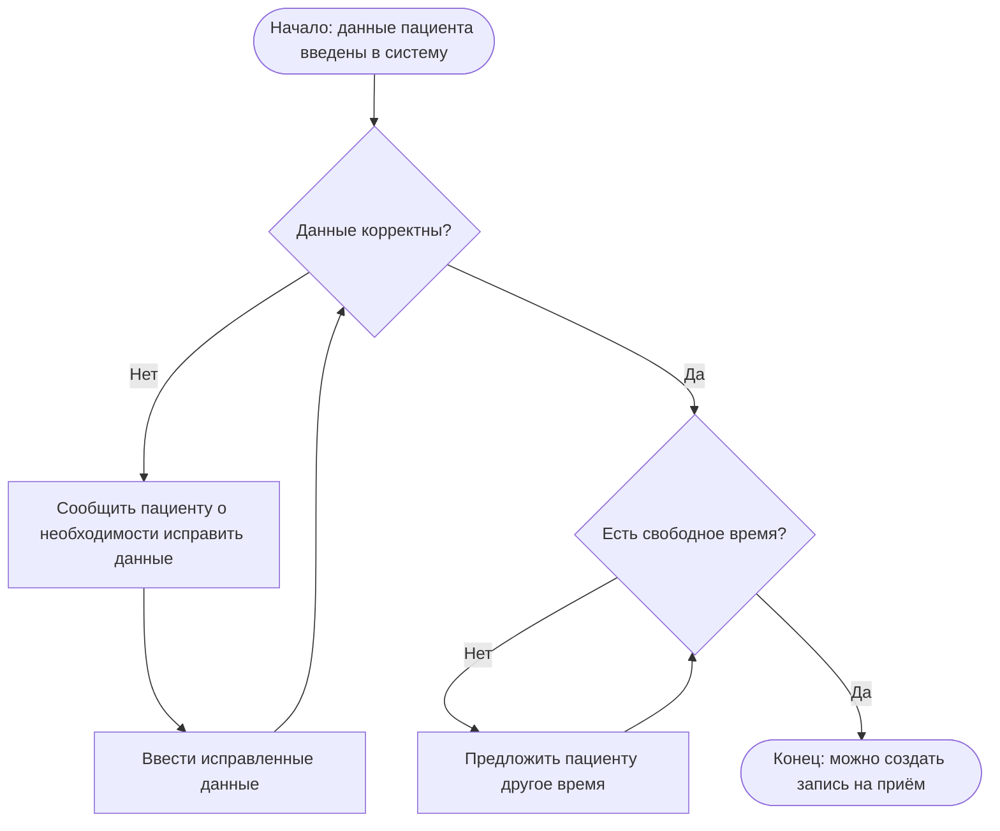

# Flowchart — Алгоритм проверки условий для записи пациента

Это алгоритм проверки условий, необходимых для того, чтобы создать запись пациента на приём: проверка корректности введённых данных и проверка наличия свободного времени.

