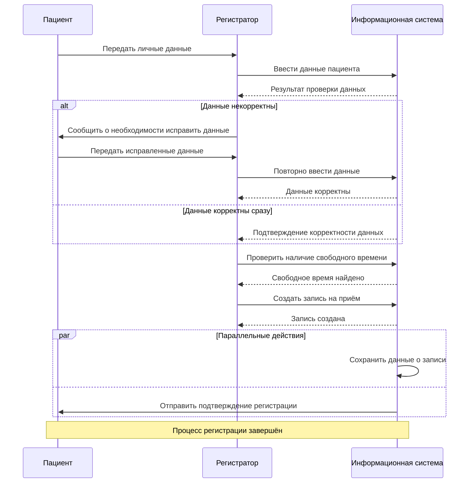

# Sequence Diagram — Регистрация пациента в клинике

Сценарий: пациент обращается в регистратуру, регистратор взаимодействует с информационной системой клиники, чтобы зарегистрировать приём.

```mermaid
sequenceDiagram
    participant P as Пациент
    participant R as Регистратор
    participant S as Информационная система

    P->>R: Передать личные данные
    R->>S: Ввести данные пациента
    S-->>R: Результат проверки данных

    alt Данные некорректны
        R->>P: Сообщить о необходимости исправить данные
        P->>R: Передать исправленные данные
        R->>S: Повторно ввести данные
        S-->>R: Данные корректны
    else Данные корректны сразу
        S-->>R: Подтверждение корректности данных
    end

    R->>S: Проверить наличие свободного времени
    S-->>R: Свободное время найдено

    R->>S: Создать запись на приём
    S-->>R: Запись создана

    par Параллельные действия
        S->>S: Сохранить данные о записи
    and
        S->>P: Отправить подтверждение регистрации
    end

    Note over P,S: Процесс регистрации завершён
```
