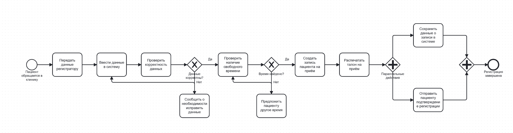
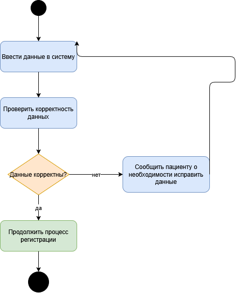
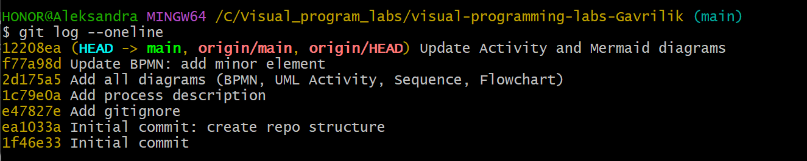
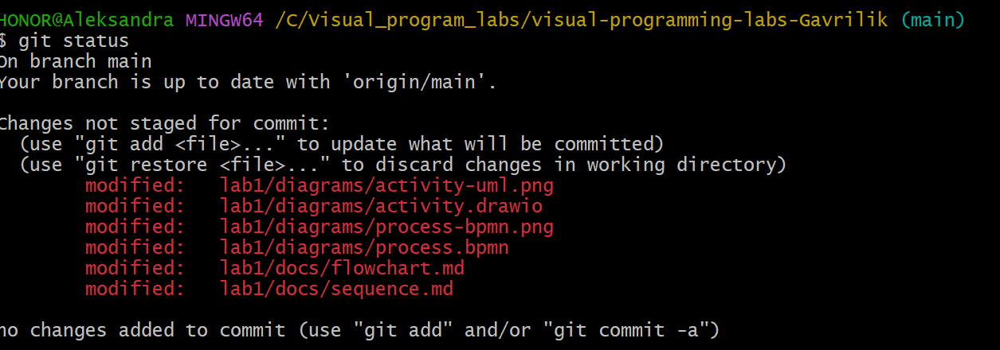
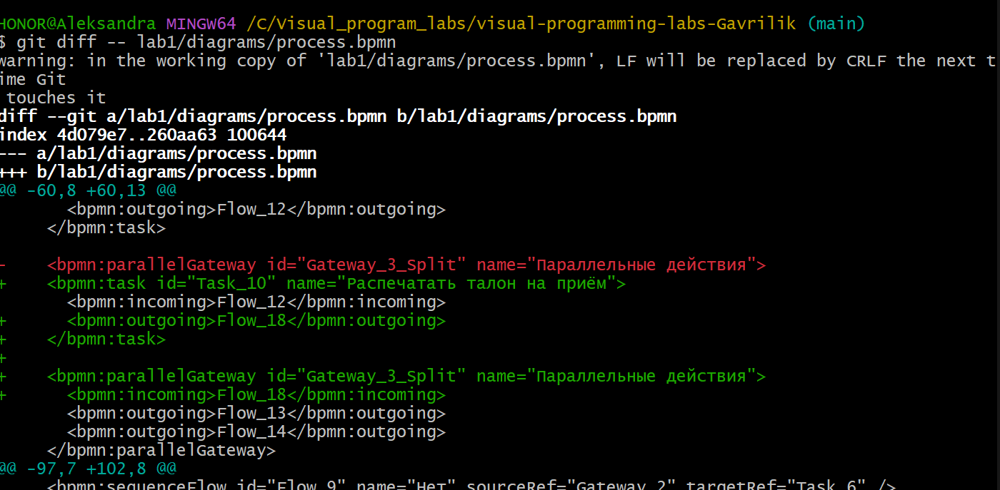
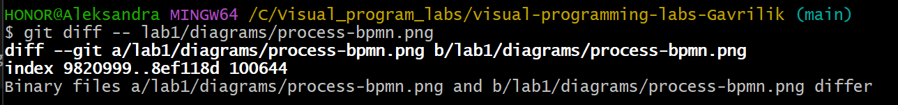
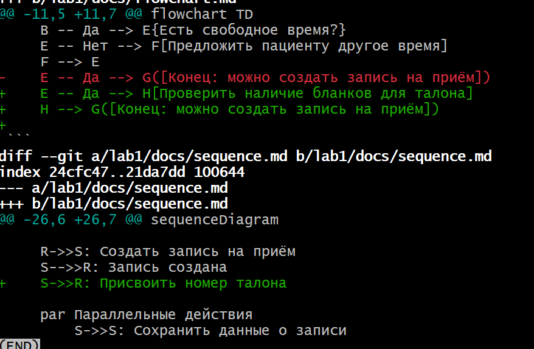

# Отчёт по лабораторной работе №1

## Тема

Моделирование процессов с использованием Git и визуальных нотаций.

## Описание процесса

В работе был рассмотрен процесс регистрации пациента в клинике. В процессе участвуют пациент, регистратор и информационная система клиники. Сначала проверяются данные пациента, после чего выполняется проверка доступности времени для записи. При обнаружении ошибок данные исправляются, а при отсутствии свободного времени выбирается другое время. После успешной регистрации информация сохраняется, а пациент получает подтверждение.

## BPMN

## UML Activity Diagram

## Sequence Diagram

Диаграмма последовательности была создана с использованием Mermaid и показывает взаимодействие пациента, регистратора и информационной системы.

## Flowchart

Блок-схема описывает алгоритм проверки доступности времени для записи пациента.

## Работа с Git

В процессе выполнения лабораторной работы использовались коммиты для фиксации основных этапов работы.

### История коммитов

### Проверка состояния репозитория

### Изменение BPMN-файла

Для BPMN-файла Git позволяет увидеть конкретные изменения в XML-коде.

### Изменение PNG-файла

PNG является бинарным файлом, поэтому Git не показывает изменения отдельных строк.

### Изменение Mermaid-файла

Для текстового Mermaid-файла Git показывает конкретные строки, которые были изменены.

## Вывод

В ходе лабораторной работы были освоены основные операции Git и GitHub, а также создание BPMN, UML Activity, Sequence Diagram и Flowchart. Я увидела различие между версиями текстовых и бинарных файлов и научилась сохранять результаты работы в одном Git-репозитории.