# Лабораторная работа №2. Node-RED

**Автор:** Gavrilik, группа ИИ
**Курс:** Технологии визуального программирования
**Цель:** освоить Node-RED как low-code инструмент: собрать и задеплоить потоки, познакомиться с базовыми и расширенными нодами.

---

## 1. Краткое описание выполненного

Node-RED запущен в Docker. Собрано 12 потоков по заданию (пункты 2.1–2.12), каждый сохранён отдельным файлом `flow-NN-<имя>.json` в `lab2/flows/`. Дополнительно выполнена ачивка 15: интеграция с Notion (запись и чтение данных через Notion API).

| № | Тема | Flow | Скриншот |
|---|------|------|----------|
| 2.1 | inject → debug | `flow-01-inject-debug.json` | `01-inject-debug.png` |
| 2.2 | function | `flow-02-function.json` | `02-function.png` |
| 2.3 | switch | `flow-03-switch.json` | `03-switch.png` |
| 2.4 | change | `flow-04-change.json` | `04-change.png` |
| 2.5 | template | `flow-05-template.json` | `05-template.png` |
| 2.6 | http request | `flow-06-http-request.json` | `06-http-request.png` |
| 2.7 | MQTT | `flow-07-mqtt.json` | `07-mqtt.png` |
| 2.8 | GET-эндпоинты | `flow-08-endpoints.json` | `08-endpoints.png` |
| 2.9 | Dashboard | `flow-09-dashboard.json` | `09-dashboard.png` |
| 2.10 | Telegram-бот | `flow-10-telegram.json` | `10-telegram.png` |
| 2.11 | Файлы | `flow-11-files.json` | `11-files.png` |
| 2.12 | Контекст | `flow-12-context.json` | `12-context.png` |
| Ачивка 15 | Notion | `flow-13-notion.json` | `13-notion.png` |

---

## 2. Способ установки, версии Node-RED и Node.js

**Способ установки:** Docker (через Docker Desktop), готовый образ `nodered/node-red`.

- Образ (image) это шаблон, контейнер (container) это запущенный экземпляр образа.
- Контейнер называется `mynodered`, редактор доступен на http://localhost:1880.
- Для сохранения данных при перезапусках папка на компьютере подключена как volume к папке `/data` внутри контейнера.

Команда запуска: docker start mynodered

```bash
docker run -d -p 1880:1880 -v ~/node-red-data:/data --name mynodered nodered/node-red
```

**Версии:**

- Node-RED: v5.0.7
- Node.js: v24.20.0

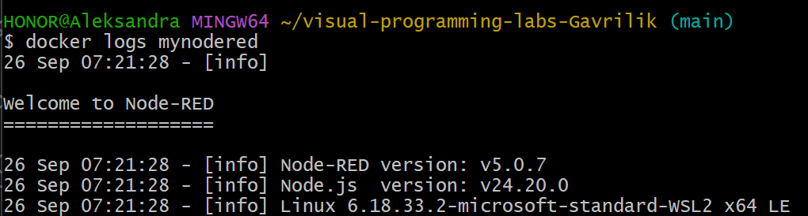

---

## 3. Освоенные ноды

| Нода | Для чего используется | Где применена |
|------|----------------------|---------------|
| inject | запуск flow вручную или по таймеру, источник тестовых данных | везде |
| debug | вывод сообщения в боковую панель (payload или весь msg) | везде |
| function | произвольная обработка на JavaScript | 2.2, 2.3, 2.7, 2.8, 2.9, 2.10, 2.11, 2.12, ачивка |
| switch | ветвление по правилам | 2.3 |
| change | установка, изменение и удаление полей сообщения без кода | 2.4 |
| template | формирование текста или JSON по шаблону Mustache | 2.5, 2.8 |
| http request | HTTP-запросы к внешним API | 2.6, ачивка 15 |
| mqtt in / mqtt out | публикация и подписка через MQTT-брокер | 2.7 |
| http in / http response | собственные HTTP-эндпоинты | 2.8 |
| gauge, chart (dashboard) | визуализация значений и истории | 2.9 |
| telegram receiver, command, sender | Telegram-бот | 2.10 |
| write file, read file | запись и чтение файлов | 2.11 |
| flow context | хранение состояния между сообщениями | 2.12 |

---

## 4. Описание потоков

### 2.1. Inject → Debug
`inject → debug`. В inject: `msg.payload` строка с фамилией, `msg.topic = "lab2/Gavrilik/basic"`, повтор каждые 5 секунд. В debug выбран вывод **complete msg object**, поэтому видны `topic`, `_msgid` и остальные поля, а не только payload.

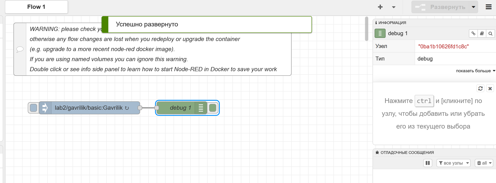

### 2.2. Function
`inject → function → debug`. Код function сгенерирован с помощью AI и использует `let/const`, `if/else`, цикл `for`, массив и объект; функция возвращает объект с полем `payload`.

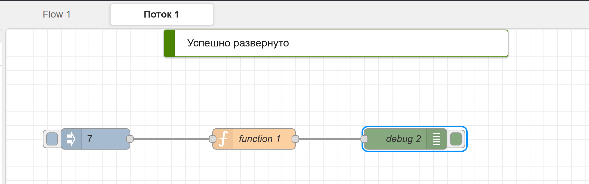

### 2.3. Switch
`inject → function → switch → debug (выход 1) / debug (выход 2)`. Function считает сумму чисел от 1 до N и возвращает объект. Switch проверяет `msg.payload.sum`: если больше 20, сообщение уходит в выход 1 («Большая сумма»), иначе (правило «иначе») в выход 2 («Малая сумма»). Проверено на значениях 7 (сумма 28) и 3 (сумма 6).

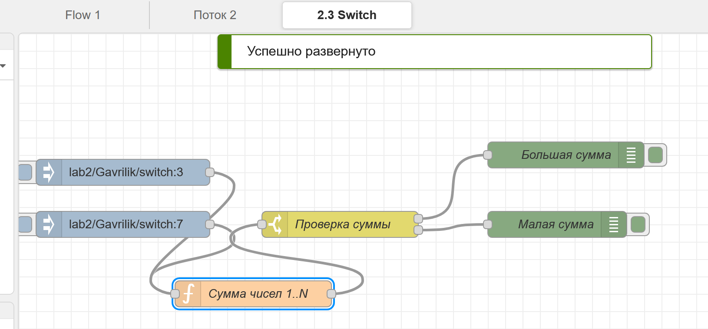

### 2.4. Change
`inject → change → debug`. Нода change устанавливает три поля: `msg.topic = "lab2/Gavrilik/change"`, `msg.timestamp` (тип timestamp, текущее время в миллисекундах) и `msg.payload` (строка с фамилией и группой). В debug показан complete msg object.

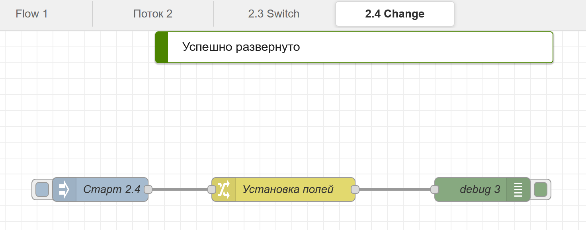

### 2.5. Template
`inject → template → debug`. Inject передаёт объект `{surname, group, score}`. Шаблон Mustache (Property = `msg.payload`, вывод как JSON) собирает из него новый JSON. Для значения `topic` используются тройные скобки `{{{topic}}}`, потому что двойные `{{ }}` экранируют HTML-символы и слэши превращаются в `&#x2F;`.

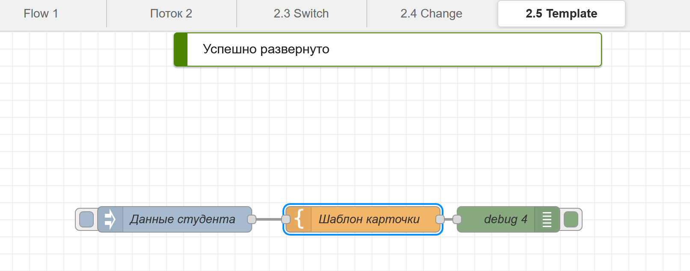

### 2.6. HTTP Request
`inject → http request → debug`. GET-запрос к публичному API https://api.chucknorris.io/jokes/random (без регистрации и токенов), Return = a parsed JSON object. Текст шутки лежит в `msg.payload.value`, код ответа (200) в `msg.statusCode`.

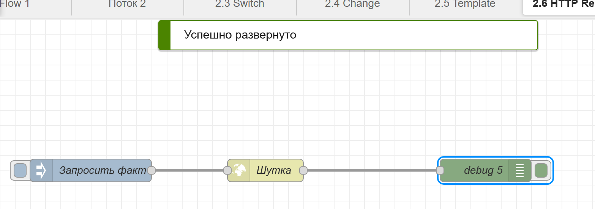

### 2.7. MQTT с публичным брокером
Две ветки: `inject (каждые 5 с) → function → mqtt out` публикует случайное число, `mqtt in → debug` получает его обратно. Брокер: `broker.hivemq.com:1883`, топик `student/Gavrilik/lab2/random`. Сообщение возвращается из брокера, что подтверждает доставку. MQTT работает по схеме публикация/подписка: издатель и подписчик не знают друг о друге, обмен идёт через брокера по топикам.

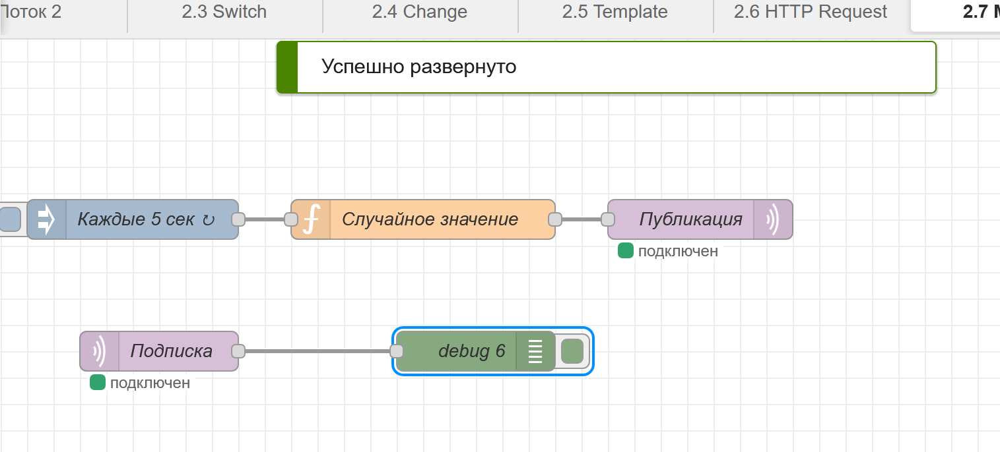

### 2.8. GET-эндпоинты
Три эндпоинта, у каждого своя пара `http in` и `http response`: `GET /api/text` (простой текст), `GET /api/info` (JSON с двумя полями), `GET /api/items` и `GET /api/items/:id` (path- и query-параметры, ответы 200, 400, 404). Подробное описание, примеры запросов и ответов в [api.md](api.md).

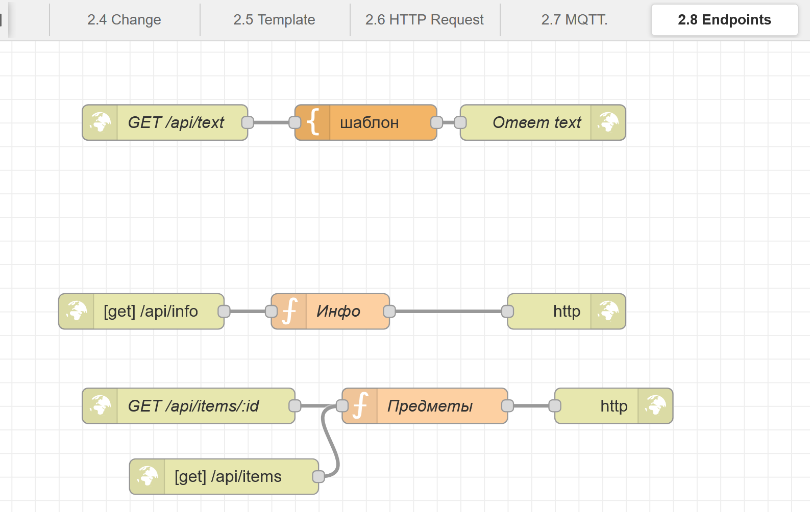


### 2.9. Dashboard
Установлен пакет `node-red-dashboard`. `inject (каждые 2 с) → function → gauge и chart`. Function имитирует датчик температуры (случайное значение 20–30 °C). Gauge показывает текущее значение, chart хранит историю. Группа «Датчики», вкладка «Gavrilik Lab2», страница http://localhost:1880/ui.

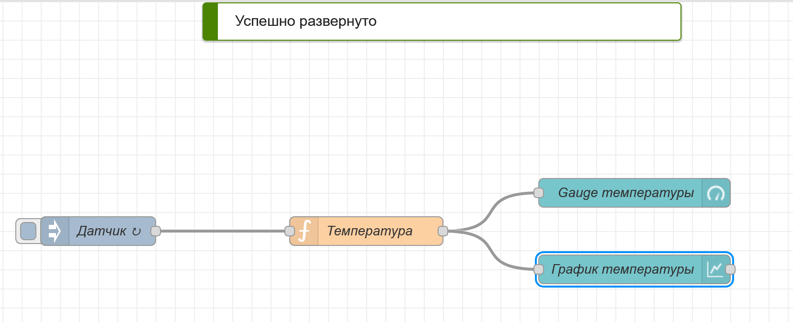

### 2.10. Telegram-бот
Бот создан через BotFather: `tvl_lab2_gavrilik_bot`. Установлен пакет `node-red-contrib-telegrambot`. Команды `/start` (приветствие) и `/time` (текущее время сервера), на остальные сообщения бот отвечает эхом. Функция echo пропускает сообщения, начинающиеся с `/`, чтобы команды не обрабатывались дважды. Токен хранится в конфигурации Node-RED и в репозиторий не попадает.

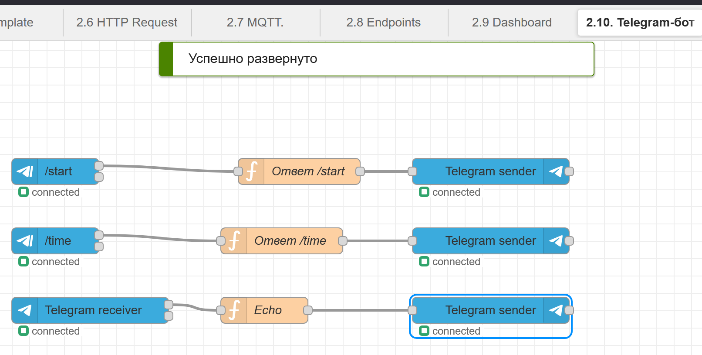

### 2.11. Чтение и запись файла
Две ветки: `inject → function → write file` (режим «добавить в файл») и `inject → read file → debug`. Файл `/data/lab2-gavrilik.txt` лежит в папке, подключённой как volume, поэтому данные сохраняются при перезапуске контейнера. Проверено командой `docker restart mynodered` и чтением файла после неё.

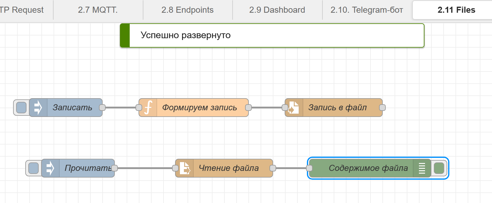

### 2.12. Контекст
Использован flow context. Сценарий: счётчик, который живёт между сообщениями. Три ветки: «+1» (`flow.get("counter")`, увеличение, `flow.set`), «Прочитать» и «Сбросить». Значение хранится вне сообщения и доступно всем нодам вкладки. По умолчанию контекст хранится в памяти и сбрасывается при перезапуске контейнера; для хранения на диске нужно настроить `contextStorage` в `settings.js`. Виды контекста: node (одна нода), flow (вкладка), global (весь Node-RED).

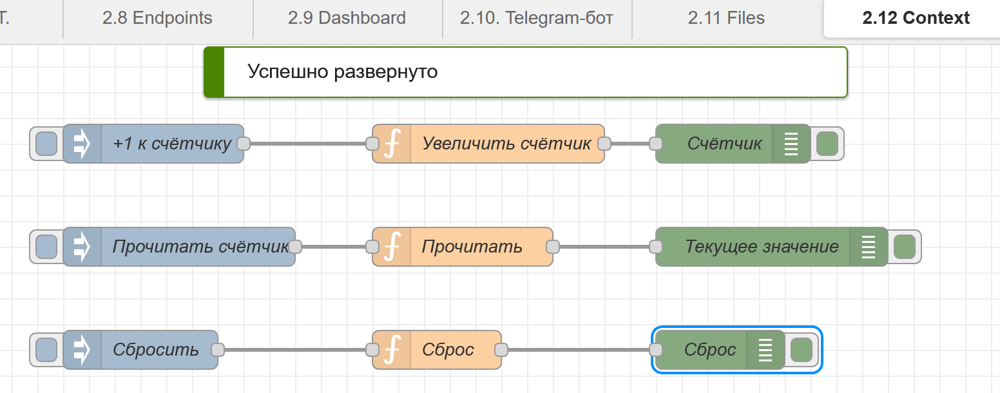

---

## 5. Ачивка 15. Интеграция с Notion

Данные из Node-RED записываются в таблицу Notion и читаются обратно через Notion API.

- **Доступ:** в Notion создано подключение (connection) `Lab2 Gavrilik` с правами на чтение, обновление и вставку содержимого; страница с таблицей подключена через меню Connections. Токен вводится в ноду `http request` (Bearer authentication) и хранится в учётных данных Node-RED, поэтому в экспортированный flow и репозиторий не попадает.
- **Таблица:** колонки `Name` (title), `Value` (number), `Author` (text).
- **Запись:** `inject → function → http request (POST /v1/pages) → debug`.
- **Чтение:** `inject → function → http request (POST /v1/databases/{id}/query) → function (разбор results) → debug`.

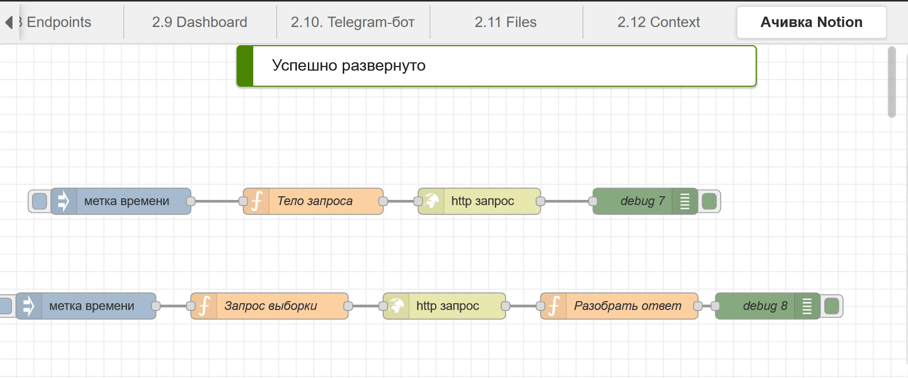


---

## 6. Использованные AI-промпты

Ключевые примеры:

1. «Напиши код для function node, где используются let/const, if/else, цикл for, массив и объект, и функция возвращает объект с полем payload.» (пункты 2.2, 2.3)
2. «Напиши Mustache-шаблон для Node-RED, который из объекта с полями surname, group, score формирует JSON.» (пункт 2.5)
3. «Сделай три GET-эндпоинта в Node-RED, третий с path и query параметрами и ответами 400 и 404, и опиши их в api.md.» (пункт 2.8)
4. «Как сохранять данные из flow в Notion и читать их обратно через http request?» (ачивка 15)

---

## 7. Возникшие проблемы и решения

| Проблема | Причина | Решение |
|----------|---------|---------|
| В template вместо `/` в topic получилось `&#x2F;` | Mustache `{{ }}` экранирует HTML-символы | тройные скобки `{{{topic}}}` |
| Template выводил шаблон как есть | в поле формата стоял «Простой текст», а не Mustache | выбран синтаксис Mustache |
| `RangeError: Invalid time zone` в боте | неверное название часового пояса в `toLocaleString` | убран параметр `timeZone` |
| `docker exec ... cat /data/...` искал путь `C:/Program Files/Git/data/...` | Git Bash переписывает пути, начинающиеся со слэша | путь с двойным слэшем `//data/...` |
| Notion вернул `401 unauthorized` | в ноде http request не была включена Bearer-авторизация | включена авторизация, токен введён в обеих нодах |

---

## 8. Выводы

В лабораторной я освоила Node-RED как low-code инструмент: потоки собираются из готовых нод, а свой код нужен только в function. Я запускала его в Docker, работала с сообщениями, контекстом и файлами, подключала внешние API, MQTT, Telegram-бота и dashboard, а в ачивке настроила обмен данными с Notion. Больше всего я поняла, как сообщение проходит через цепочку нод и меняется по пути. Самыми трудными оказались мелкие детали вроде авторизации, экранирования в шаблонах и путей в Git Bash.
