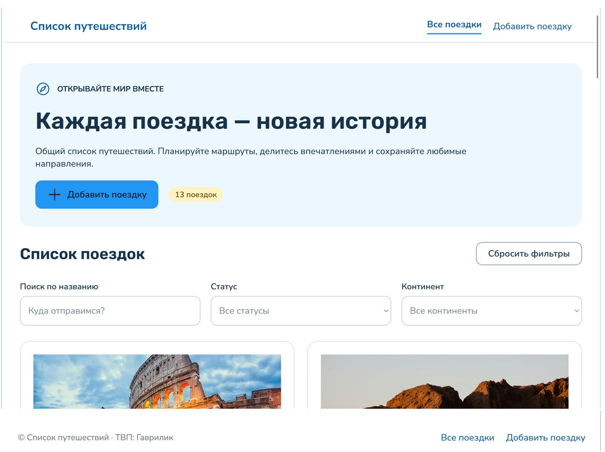

# Лабораторная работа №3. Bubble

## 1. Краткое описание выполненного

_(заполню в конце)_

## 2. Промпт (дословно, часть 1)

```
Создай приложение на тему «Список путешествий»
Пусть этот сайт будет публичный
Страницу обязательно создай по структуре header + body + footer
Обязательно укажи в заготовке следующую строку: «ТВП: Гаврилик»
Добавь несколько интерактивных элементов (реализующих CRUD)
```

## 3. Ссылка на dev-версию приложения

https://bubble.io/page?id=my-app-261006-71085&tab=Preview&name=index&ai_generated=true

## 4. Использованные AI-промпты (дословно)

### 4.1. Промпт для каркаса приложения
_(см. раздел 2)_

### 4.2. Промпт для новой сущности (часть 4.1)
_(...)_

### 4.3. Промпт для UI страницы с CRUD (часть 4.2)
_(...)_

## 5. Освоенные элементы и workflows

_(...)_

## 6. Скриншоты по шагам

### Часть 1. Генерация каркаса

### Часть 2. Build Guides (до / после)
### Часть 3. Ручная доработка UI
### Часть 4. Data и Workflows
### Часть 5. Ачивка

## 7. Выводы

_(своими словами)_
